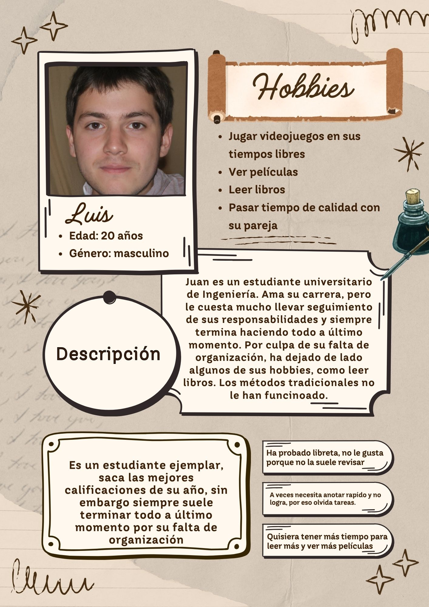

Diego Andre Calderón Salazar - 241263

# Investigación: Aplicación de Organización Centralizada para Universitarios

## 1. Contexto del Mercado (2026)

El mercado global de apps de productividad estudiantil supera los **$4.5 mil millones de dólares**, impulsado principalmente por la digitalización académica y la necesidad de optimizar el tiempo.

El problema principal que encontré al investigar es la **fragmentación de herramientas**: los estudiantes se ven obligados a saltar entre varias plataformas para gestionar un solo día. Nunca hay una sola app que lo haga todo.

---

## 2. Competencia

Investigué las apps más usadas para organización académica y esto es lo que encontré:

- **Todoist:** Muy buena para listas de tareas con lenguaje natural, pero le falta un sistema nativo de agenda visual o diseño diario por bloques de tiempo.
- **Notion:** Altamente personalizable, pero la curva de aprendizaje es enorme. El tener tantas opciones hace que muchos la abandonen antes de sacarle provecho real. Tampoco permite el registro rapido que necesita un estudiante en movimiento.
- **Google Calendar / Calendarios tradicionales:** Útiles para eventos fijos, pero demasiado rígidos. No integran bien las tareas pendientes del día con los bloques de tiempo pequeños.
- **Structured / TickTick:** Intentan unir calendario y tareas, pero suelen requerir suscripción de pago o simplemente no están enfocadas exclusivamente en el entorno universitario.

---

## 3. Tipo de Usuario

El diseño gira en torno a **Luis**, un perfil arquetípico construido a partir de las necesidades reales de los estudiantes actuales.

- **Perfil:** Hombre, 20 años, estudiante ejemplar de Ingeniería. Saca excelentes calificaciones pero cae en procrastinación estructural por falta de organización.
- **Puntos de dolor:**
    - Termina entregando todo a último momento.
    - Los métodos tradicionales (como libretas físicas) le fallan porque olvida revisarlas constantemente.
    - Necesita registrar tareas de forma inmediata para que no se le olviden antes de poder agendarlas.
- **Impacto:** Ha tenido que abandonar sus pasatiempos prioritarios (leer libros, ver películas, pasar tiempo con su pareja) por la saturación de pendientes mal distribuidos.

---

## 4. Técnicas utilizadas

### Lluvia de Ideas

Me permitió mapear las fricciones principales de los estudiantes. La conclusión fue que las apps tradicionales de To-Do fallan porque no permiten organizar por bloques específicos de tiempo y no centralizan el calendario con el día a día.

### Mapa Mental

Conecté la idea central (mejorar la organización de tareas) con soluciones técnicas concretas: ingreso rápido desde el celular, visualización sencilla, fechas de entrega opcionales y estructuración por horas del día.

### Roleplay: Arthur Morgan (RDR2)

Usé este personaje para analizar el comportamiento de registro bajo fricción extrema. De analizar su bitácora en el juego, saqué dos ideas clave:

- **Vistas diarias exclusivas:** cada página representa estrictamente un día con sus tareas inmediatas.
- **Secciones separadas:** notas rápidas por un lado, planificación técnica a largo plazo por el otro.

---

## 5. Propuesta de Valor

La investigación concluye que la app no debería competir agregando más funciones, sino unificando las existentes bajo el concepto de acceso rápido.

La solución ideal es una aplicación móvil centralizada que combine el To-Do list, la agenda diaria por bloques horarios y el calendario en una sola interfaz limpia. Así se evita la fatiga de tener que usar múltiples herramientas para gestionar un solo día.
