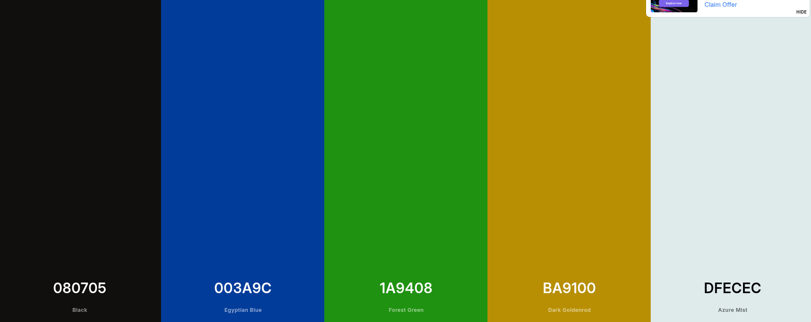

La paleta de colores elegida es:

| Color          | Hex       | Rol                                                                          |
| -------------- | --------- | ---------------------------------------------------------------------------- |
| Negro nocturno | `#080705` | Fondo principal                                                              |
| Azul tech      | `#003A9C` | Acento / elementos interactivos (no usar como superficie adyacente al negro) |
| Verde muted    | `#1A9408` | Indicadores de éxito / elementos especiales                                  |
| Dorado         | `#BA9100` | Highlights / alertas de prioridad                                            |
| Azure Mist     | `#DFECEC` | Texto principal sobre fondos oscuros                                         |

Con estos colores busco transmitir modernidad, seguridad y estética nocturna tecnológica. Azul como acento de interacción, verde para confirmaciones, dorado para prioridad alta.

---

**Tipografía (3 fuentes):**

| Fuente            | Uso                                       | Ejemplo                                |
| ----------------- | ----------------------------------------- | -------------------------------------- |
| Plus Jakarta Sans | Títulos de sección + Botones + Navegación | "Lunes 15 de Junio", "Añadir tarea"    |
| Inter             | Lista de tareas                           | Máxima legibilidad para lectura rápida |
| JetBrains Mono    | Horarios / Bloques de tiempo              | Sensación de precisión técnica         |
