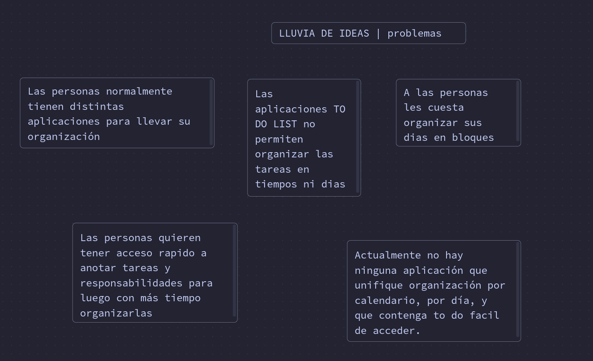
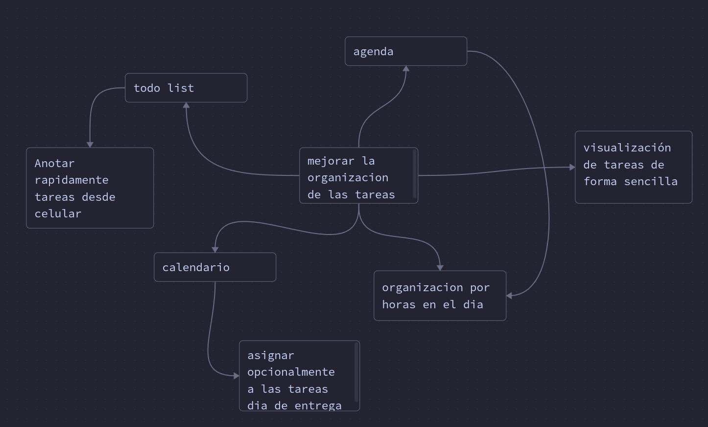

# Las 3 ideas que escogí son: 

## Ideas #4: Lluvia de ideas

Un clásico, no podía hacerles una lista de herramientas recomendadas sin mencionar esta. 

Esta funciona mejor como una actividad en grupo, así que si quieren hacer grupos para armar una lluvia de ideas, es perfectamente válido.

Les dejo una guía de algunas buenas prácticas para realizar una lluvia de ideas:

https://youtu.be/9K8W4ooygUU

### Mi lluvia de ideas:

---
# Ideas #6: Mapa mental

Otra técnica clásica, la creación de un mapa de ideas. Esta es particularmente útil para aquellos que tengan una idea básica de lo que quieren hacer pero que aún necesita trabajarse. 

Esta técnica consiste en construir una red de relaciones. Escriban una frase que represente su idea en la mitad de una pagina y escriban otras ideas alrededor de ella. Después dibujen lineas para conectar las ideas relacionadas. 

Hay herramientas para realizar esto en línea:

[https://www.mindmup.com/Links to an external site.](https://www.mindmup.com/)
### Mi mapa mental: 

---
# Ideas #11: Role play

Si ustedes no logran encontrar un problema para solucionar, podría Arthur Morgan lograrlo?

Esta técnica es para cambiar su manera de pensar un poco, escojan a su super heroe, o personaje de anime o alguien que ustedes admiren y traten de encontrar ideas desde su perspectiva.

### Mi Roleplay: Arthur Morgan (RDR2)

Para esto escogí a **Arthur Morgan** de red dead redemption 2

Si arthur tuviera que hacer algo de ihc, seguro usaria su libreta para anotar sus responsabilidades y no olvidar que tiene que hacer con su grupo (la banda). 

**Como funcionaria la libreta:**
- **Notas:** anotaria los pendientes que tiene que realizar en notas y tal vez las definiría en párrafos
- **Dibujos:** en vez de cosas tecnicas, haria dibujos a mano de como se deberia ver la pantalla. 
- **Diario**: el diario ya está incluído tal cual en el juego, pero arthur seguramente llevaría un conteo de las tareas que debe realizar HOY en otra sección a parte del diario. Cada página sería un día y ahí anotaría las tareas. 

---

